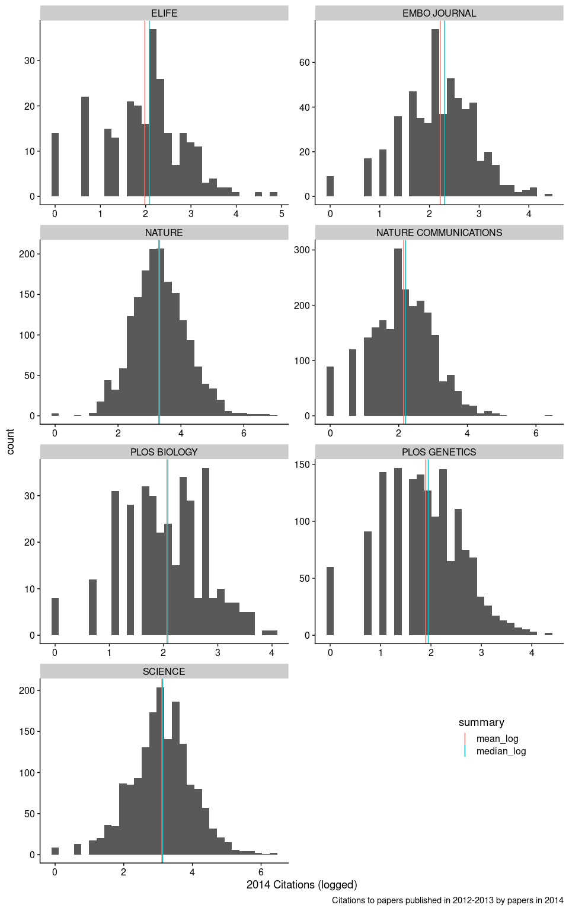

<!-- README.md is generated from README.Rmd. Please edit that file -->

``` r
library(ggplot2)
theme_set(cowplot::theme_cowplot())
library(dplyr)
```

# Stephen Curry Journal Impact Factor Publication

<!-- badges: start -->
<!-- badges: end -->

Looking at the data presented in the [preprint on the distribution of
Journal Impact Factors
(JIF)](https://www.biorxiv.org/content/10.1101/062109v2.full#disqus_thread)
(Larivière et al., 2015), I wondered what happens if we do the stupid
thing and log-transform them.

## Data

Following the guide provided in the Appendix of the preprint, I went
into Web Of Science and produced citation reports for 7 journals, and
saved them. Unfortunately, the preprint shows data for publications
published in 2013-2014, but the guide showed 2012-2013, so I ended up
downloading the citation data for publications published in 2012-2013,
which would have influenced the 2014 JIF. However, I think the
conclusions are the same.

I exported the data as text, and those files are in the [data](data)
folder.

``` r
all_files = dir(here::here("data"), full.names = TRUE)
all_data = purrr::map(all_files, function(in_file){
  message(basename(in_file))
  tmp_lines = readLines(in_file, n = 10)
  start_line = which(grepl("Title", tmp_lines))[1]
  
  tmp = read.table(in_file, header = TRUE, sep = ",", skip = start_line - 1)
  tmp$Issue = as.character(tmp$Issue)
  tmp
})

all_df = purrr::imap_dfr(all_data, function(.x, .y){
  .x$Ending.Page = as.integer(.x$Ending.Page)
  .x$Article.Number = as.integer(.x$Article.Number)
  .x
})
```

## Original Plot

``` r
ggplot(all_df, aes(x = X2014)) + 
  geom_histogram() +
  facet_wrap(~ Source.Title, ncol = 2, scales = "free") +
  labs(caption = "Citations to papers published in 2012-2013 by papers in 2014",
       x = "2014 Citations")
```

<!-- -->

These plots look a lot like those presented in the preprint. To **my**
eye, in addition to being heavily tailed, they also look like they could
be **log-normal**. An easy way to check would be to log the counts and
replot them (in this case log + 1 to account for 0).

## Log Plot

``` r
summary_df = dplyr::group_by(all_df, Source.Title) %>%
  dplyr::summarise(mean_log = mean(log1p(X2014)),
                   median_log = median(log1p(X2014))) %>%
  tidyr::pivot_longer(!Source.Title, names_to = "summary")
ggplot(all_df, aes(x = log1p(X2014))) + 
  geom_histogram() +
  geom_vline(data = summary_df,
             aes(xintercept = value, color = summary)) +
  facet_wrap(~ Source.Title, ncol = 2, scales = "free") +
  labs(caption = "Citations to papers published in 2012-2013 by papers in 2014",
       x = "2014 Citations (logged)") +
  theme(legend.position = c(0.8, 0.15))
```

<!-- -->

Here we plotted the histogram of the log + 1 of the counts, and the mean
and median of those logs. The fact that the mean and median are *almost*
the same implies these distributions are fine.

Looking at the summary values, we can still see which journals on
average get more citations.

``` r
sorted_summary = dplyr::filter(summary_df, summary %in% "mean_log") %>%
  dplyr::arrange(dplyr::desc(value))
knitr::kable(sorted_summary, digits = 2)
```

| Source.Title          | summary   | value |
|:----------------------|:----------|------:|
| NATURE                | mean\_log |  3.32 |
| SCIENCE               | mean\_log |  3.11 |
| EMBO JOURNAL          | mean\_log |  2.22 |
| NATURE COMMUNICATIONS | mean\_log |  2.14 |
| PLOS BIOLOGY          | mean\_log |  2.06 |
| ELIFE                 | mean\_log |  1.98 |
| PLOS GENETICS         | mean\_log |  1.89 |

## Conclusion

The simplest solution to JIF if it continues to be used is to
log-transform the citation counts in a given year (using log + 1).

## License

<a rel="license" href="http://creativecommons.org/licenses/by/4.0/"></a><br />This
work is licensed under a
<a rel="license" href="http://creativecommons.org/licenses/by/4.0/">Creative
Commons Attribution 4.0 International License</a>.

The data files under [data](data) are licensed under the CC0 license.
